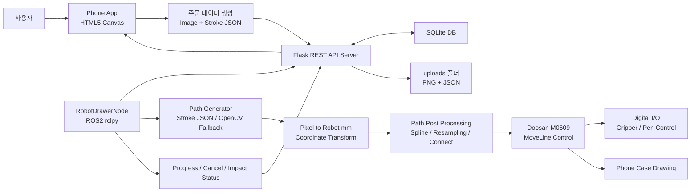
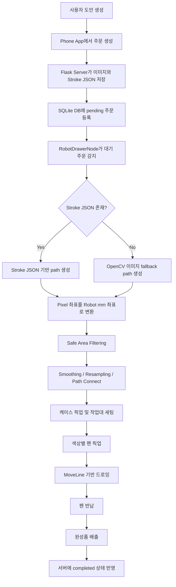
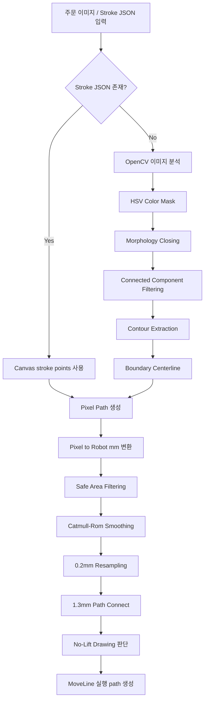
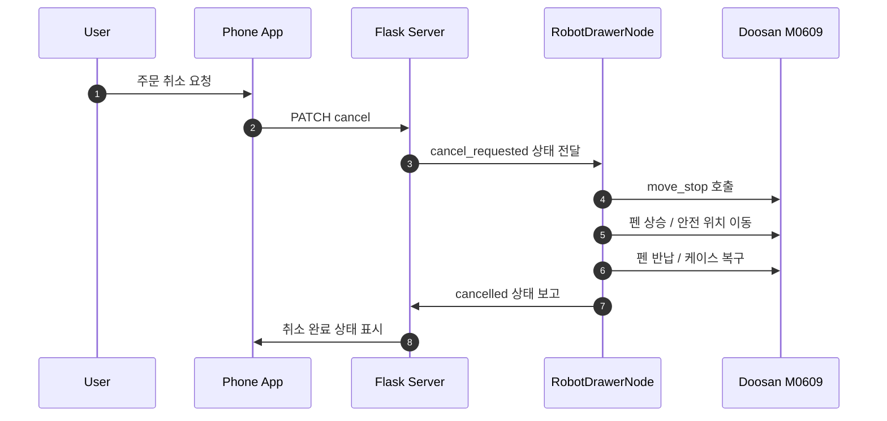
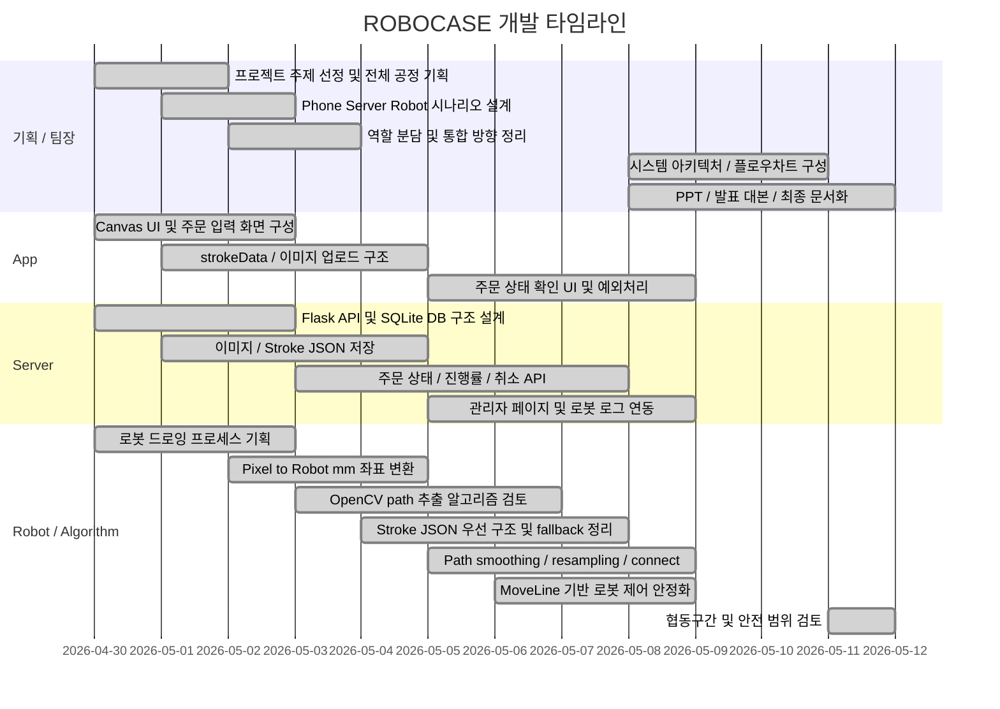

# ROBOCASE

<p align="center">
  <b>Doosan M0609 기반 폰케이스 드로잉 자동화 · Phone App · Flask Server · ROS2 Robot Control 통합 시스템</b><br>
  ROS 2 Humble · Doosan Robotics M0609 · Flask · SQLite · HTML5 Canvas · OpenCV · Stroke JSON · MoveLine Control
</p>

<p align="center">
  
  
  
  
  
  
</p>

<p align="center">
  <a href="#0-프로젝트-한-줄-요약">요약</a> ·
  <a href="#3-주요-기능">주요 기능</a> ·
  <a href="#4-시스템-설계">시스템 설계</a> ·
  <a href="#5-소스-코드-구성">소스 코드</a> ·
  <a href="#8-운영체제-환경">운영체제 환경</a> ·
  <a href="#9-사용한-장비-목록">장비</a> ·
  <a href="#10-의존성-requirements">의존성</a> ·
  <a href="#11-실행-순서-launch-순서-및-스크립트">실행 순서</a> ·
  <a href="#15-디버깅-및-알고리즘-개선-요약">디버깅</a>
</p>

---

## 0. 프로젝트 한 줄 요약

**ROBOCASE**는 사용자가 웹 앱에서 직접 그린 도안 또는 업로드한 이미지를 주문으로 등록하면, Flask 서버가 도안 데이터와 주문 상태를 관리하고, **Doosan M0609 협동로봇**이 해당 도안을 실제 폰케이스 위에 자동으로 그리는 **협동로봇 기반 커스텀 폰케이스 제작 자동화 시스템**입니다.

본 프로젝트에서 저는 **팀장으로서 프로젝트 기획, 전체 시나리오 설계, 로봇 드로잉 공정 설계, 시스템 아키텍처 정리, 로봇 동작 알고리즘 구현 방향, 발표 자료 구성**을 주도했습니다.  
특히 단순히 웹과 로봇을 연결하는 수준이 아니라, **사용자 주문 → 서버 저장 → 로봇 작업 감지 → 경로 생성 → 케이스 픽업 → 펜 픽업 → MoveLine 드로잉 → 완료/취소/충격 정지 상태 반영**까지 하나의 자동화 공정 시나리오로 설계했습니다.

```text
사용자 도안 생성
→ Phone App에서 Canvas 이미지와 Stroke JSON 생성
→ Flask Server가 주문/이미지/JSON 저장
→ SQLite DB에 주문 상태 기록
→ RobotDrawerNode가 대기 주문 감지
→ Stroke JSON 우선 경로 생성
→ JSON이 없으면 OpenCV 이미지 fallback 경로 생성
→ Pixel 좌표를 Robot mm 좌표로 변환
→ 케이스 픽업 및 작업 위치 세팅
→ 색상별 펜 픽업
→ MoveLine 기반 드로잉 수행
→ 펜 반납 및 완성품 배출
→ 서버/앱에 완료 또는 예외 상태 반영
```

---

## 1. 프로젝트 개요

ROBOCASE는 단순히 로봇팔을 움직이는 데모가 아니라, **사용자 주문 기반 커스텀 제작 공정을 앱·서버·로봇으로 연결한 협동로봇 자동화 프로젝트**입니다.

기존의 로봇팔 실습은 고정된 좌표를 반복 이동하는 경우가 많습니다. 이 프로젝트에서는 사용자가 직접 그린 도안이 매번 달라질 수 있다는 조건을 반영하여, 웹 Canvas의 stroke 데이터를 로봇 경로로 변환하고 실제 M0609 로봇팔이 폰케이스 위에 그리도록 구성했습니다.

| 항목 | 내용 |
|---|---|
| 프로젝트명 | ROBOCASE / phone_ggu_ggu |
| 조 이름 | C-2 ROKEY |
| 프로젝트 분류 | 협동로봇 기반 커스텀 제품 제작 자동화 |
| 주요 담당 | 팀장 / 프로젝트 기획 / 시나리오 설계 / 로봇 공정 설계 / 로봇 알고리즘 방향 설계 / 발표 구성 |
| 주요 분야 | Collaborative Robot, Robot Drawing, Web-to-Robot Automation |
| 운영체제 | Ubuntu Linux |
| ROS 버전 | ROS2 Humble |
| 로봇 | Doosan Robotics M0609 |
| 서버 | Flask REST API |
| DB | SQLite |
| 입력 UI | HTML5 Canvas |
| 경로 생성 | Stroke JSON, OpenCV, HSV Mask, Boundary Centerline |
| 로봇 제어 | MoveLine, MoveStop, Digital I/O |

---

## 2. 개발 동기

폰케이스 커스텀 제작은 사용자가 원하는 디자인이 매번 달라지는 대표적인 소량 다품종 제작 공정입니다.  
기존 방식처럼 사람이 직접 그리거나 고정된 패턴만 출력하는 구조는 주문 다양성, 반복 작업 피로도, 작업 일관성 측면에서 한계가 있습니다.

이 프로젝트에서는 사용자가 웹에서 직접 도안을 만들면, 서버가 주문과 도안을 관리하고, 로봇팔이 실제 제품 위에 그림을 그리는 구조를 설계했습니다.

| 기존 방식 | 한계 |
|---|---|
| 사람이 직접 드로잉 | 작업자 숙련도에 따라 품질 편차 발생 |
| 고정 이미지 출력 방식 | 사용자가 직접 그린 자유 도안을 반영하기 어려움 |
| 단순 로봇 좌표 이동 | 주문·도안·상태 관리와 연결되지 않음 |
| 이미지 외곽선 추출만 사용 | 한 선을 두 번 그리거나 중심 path가 불안정함 |
| 로봇 제어만 구현 | 앱/서버/DB/상태 예외처리까지 이어지는 공정 검증이 어려움 |

ROBOCASE의 접근:

```text
1. 사용자가 Phone App에서 직접 디자인한다.
2. 디자인은 이미지와 Stroke JSON으로 서버에 저장된다.
3. 서버는 주문 상태와 로봇 상태를 DB로 관리한다.
4. 로봇은 대기 주문을 감지하고 drawing path를 생성한다.
5. Stroke JSON이 있으면 원본 stroke 좌표를 우선 사용한다.
6. Stroke JSON이 없으면 OpenCV 이미지 fallback으로 path를 추출한다.
7. 좌표 변환, smoothing, resampling, path connect를 거쳐 로봇 path를 만든다.
8. MoveLine으로 실제 폰케이스에 그림을 그린다.
9. 취소, 완료, 충격 정지 상태를 서버와 앱에 반영한다.
```

---

## 3. 주요 기능

### 3.1 Phone App / Canvas 주문 생성

사용자는 웹 앱에서 폰 기종과 케이스 옵션을 선택하고, Canvas에서 직접 그림을 그리거나 이미지를 업로드할 수 있습니다.

| 기능 | 설명 | 담당 영역 |
|---|---|---|
| Canvas 드로잉 UI | 사용자가 직접 그림을 그리는 입력 화면 | App |
| 색상/굵기 설정 | 펜 색상과 stroke 굵기 조절 | App |
| Undo | 이전 stroke 되돌리기 | App |
| 이미지 업로드 | 기존 이미지를 Canvas에 반영 | App |
| 주문 생성 | 도안과 옵션을 서버로 전송 | App / Server |
| 상태 확인 | 주문 진행률, 완료, 취소, 충격 정지 상태 표시 | App / Server |

---

### 3.2 Flask Server / 주문 상태 관리

서버는 사용자 주문, 도안 이미지, Stroke JSON, 로봇 상태, 진행률, 취소 요청, 로그를 관리합니다.

| 기능 | 설명 | 담당 영역 |
|---|---|---|
| 주문 생성 API | `/api/orders`로 신규 주문 등록 | Server |
| 이미지 저장 | Base64 이미지를 `uploads/`에 저장 | Server |
| Stroke JSON 저장 | 이미지와 같은 이름의 `.json` 파일 저장 | Server |
| SQLite DB 관리 | 주문, 상태, 사용자, 로봇 로그 저장 | Server |
| 주문 상태 변경 | pending, processing, completed, cancelled 관리 | Server |
| 취소 요청 | 작업 중 주문 취소 요청 처리 | Server / Robot |
| 로봇 로그 | 작업 진행, 오류, 충격 정지 로그 저장 | Server / Robot |

---

### 3.3 RobotDrawerNode 주문 감지 및 공정 실행

로봇 제어 노드는 서버의 대기 주문을 확인하고, 작업 가능한 주문이 있으면 자동 드로잉 공정을 실행합니다.

| 단계 | 설명 |
|---|---|
| 주문 감지 | 서버 또는 DB에서 대기 주문 확인 |
| 경로 파일 확인 | 이미지 파일명 기준으로 Stroke JSON 존재 여부 확인 |
| path 생성 | JSON 우선, 없으면 OpenCV fallback |
| 케이스 픽업 | 빈 케이스를 집어 작업 위치에 세팅 |
| 펜 픽업 | 색상별 펜을 집어 드로잉 준비 |
| 드로잉 수행 | MoveLine으로 path를 따라 그림 |
| 펜 반납 | 사용한 펜을 거치대로 반납 |
| 완성품 배출 | 완성된 케이스를 배출 위치로 이동 |
| 상태 반영 | 서버에 완료/취소/정지 상태 전송 |

---

### 3.4 Stroke JSON 기반 경로 생성

직접 그린 Canvas 입력은 이미지 추정보다 정확한 원본 좌표를 포함합니다.  
따라서 로봇 경로 생성 시 Stroke JSON을 1순위로 사용했습니다.

```json
{
  "canvasWidth": 800,
  "canvasHeight": 1600,
  "strokes": [
    {
      "color": "#111111",
      "size": 5,
      "points": [
        { "x": 120.5, "y": 300.2 },
        { "x": 122.0, "y": 301.8 }
      ]
    }
  ]
}
```

| 장점 | 설명 |
|---|---|
| 원본 stroke 순서 보존 | 사용자가 실제로 그린 순서와 좌표를 유지 |
| 색상 정보 유지 | 색상별 펜 교체 로직과 연결 가능 |
| 이미지 추정보다 안정적 | Canny/Contour보다 중심 path 추정 오류가 적음 |
| 서버-로봇 연동 가능 | 이미지와 같은 stem의 `.json`을 로봇이 자동 탐색 |

---

### 3.5 OpenCV 이미지 Fallback 경로 생성

Stroke JSON이 없는 경우에도 업로드 이미지나 템플릿 도안을 처리할 수 있도록 OpenCV 기반 fallback 경로를 구성했습니다.

```text
이미지 입력
→ HSV 색상 분리
→ RED / BLUE / BLACK mask 생성
→ Morphology Closing
→ Connected Component Filtering
→ Contour 추출
→ Boundary Centerline 계산
→ Pixel path 생성
→ Robot mm 좌표 변환
```

| 알고리즘 | 목적 |
|---|---|
| HSV Color Mask | 색상별 펜 path 분리 |
| Morphology Closing | 끊긴 선 보정 |
| Connected Component | 노이즈 제거 및 선 덩어리 분리 |
| Contour | 선 영역의 boundary 추출 |
| Boundary Centerline | 외곽선 중복 드로잉 감소 |
| Safe Area Filtering | 케이스 밖 좌표 제거 |
| Catmull-Rom Spline | 곡선 보간 |
| Resampling | 점 간격 균일화 |
| Path Connect | 끊어진 path 연결 |
| No-Lift Drawing | 가까운 path는 펜을 들지 않고 연결 |

---

### 3.6 Pixel 좌표 → Robot mm 좌표 변환

웹 Canvas나 이미지 좌표는 pixel 단위이고, 로봇은 실제 공간에서 mm 단위 좌표로 움직입니다.  
따라서 pixel 좌표를 실제 폰케이스 위의 로봇 좌표로 변환하는 과정이 필요합니다.

```text
Canvas px, py
→ scale 계산
→ x_offset / y_offset 적용
→ Y축 반전
→ Robot X, Y mm
```

개념 공식:

```text
rx = draw_min_x + x_offset + px × scale
ry = draw_max_y - y_offset - py × scale
```

---

### 3.7 MoveLine 기반 로봇 드로잉 제어

최종 로봇 제어는 Doosan ROS2 service의 MoveLine을 기준으로 구성했습니다.  
MoveSplineTask도 검토했지만, 실제 로봇 실행 안정성을 위해 MoveLine 기반 순차 경로 추종으로 단일화했습니다.

| 기능 | 설명 |
|---|---|
| MoveLine | 각 path point를 직선 이동으로 추종 |
| MoveStop | 취소 또는 비정상 상황에서 즉시 정지 |
| Digital I/O | 그리퍼 및 펜 픽업/반납 제어 |
| Pen Up/Down | Z축 높이 조절로 드로잉/이동 구분 |
| Line Blend Radius | 점 사이 이동 부드럽게 연결 |
| Point Wait | 로봇 서비스 과부하 방지 |
| HOME 복귀 | 작업 시작/완료/취소 후 안전 위치 복귀 |

---

### 3.8 안전 및 예외처리

주문 취소나 외부 충격 상황은 단순한 UI 상태 변경이 아니라 실제 로봇 동작과 직접 연결됩니다.

| 예외 상황 | 처리 방식 |
|---|---|
| 주문 취소 | `cancel_requested` 감지 → MoveStop 호출 → 펜 상승 → 펜 반납 → 케이스 복구 → HOME 복귀 → cancelled 처리 |
| 외부 충격 정지 | Doosan Controller Protective/Safety Stop 우선 → RobotState 감지 → 서버 로그 전송 → impact_stopped 처리 |
| 작업 실패 | 서버 로그 기록 및 관리자 페이지 반영 |
| path 없음 | 주문 실패 또는 관리자 확인 상태로 분기 |
| 서버 통신 실패 | 재시도 또는 안전 정지 후 HOME 복귀 |

---

## 4. 시스템 설계

### 4.1 전체 시스템 아키텍처



### 4.2 주문 기반 자동 드로잉 플로우차트



### 4.3 로봇 드로잉 경로 생성 플로우차트



### 4.4 주문 취소 및 안전 정지 시퀀스



---

## 5. 소스 코드 구성

```text
ROBOCASE
├── README.md
├── requirements.txt
├── phone/
│   ├── index.html
│   ├── style.css
│   ├── app.js
│   └── load_img/
│       ├── ghost.png
│       ├── puppy.png
│       └── rabbit.png
└── phone_server/
    ├── app.py
    ├── robot_drawer.py
    ├── tcp_monitor.py
    ├── app.js
    ├── database.db
    ├── uploads/
    └── templates/
        ├── index.html
        └── admin.html
```

---

## 6. 주요 파일 설명

| 파일 | 설명 |
|---|---|
| `phone/index.html` | 사용자 도안 생성 및 주문 입력 화면 |
| `phone/style.css` | 웹 앱 UI 스타일 |
| `phone/app.js` | Canvas 드로잉, 이미지 업로드, strokeData 생성, 주문 요청 |
| `phone_server/app.py` | Flask REST API 서버, 주문/사용자/상태/로봇 로그 관리 |
| `phone_server/robot_drawer.py` | ROS2 기반 M0609 로봇 제어, 주문 감지, path 생성, MoveLine 드로잉 수행 |
| `phone_server/tcp_monitor.py` | 로봇 또는 외부 상태 모니터링 보조 코드 |
| `phone_server/database.db` | SQLite 주문 및 상태 데이터베이스 |
| `phone_server/uploads/` | 주문 이미지 및 Stroke JSON 저장 폴더 |
| `README.md` | 프로젝트 개요, 실행 방법, 시스템 설계, 디버깅 정리 문서 |
| `requirements.txt` | Python 의존성 목록 |

---

## 7. 주요 API / ROS2 인터페이스

### 7.1 Flask API

| Method | Endpoint | 설명 |
|---|---|---|
| POST | `/api/auth/signup` | 회원가입 |
| POST | `/api/auth/login` | 로그인 및 토큰 발급 |
| GET | `/api/auth/me` | 현재 로그인 사용자 확인 |
| POST | `/api/orders` | 신규 주문 생성 |
| GET | `/api/orders` | 전체 주문 목록 조회 |
| GET | `/api/my/orders` | 내 주문 목록 조회 |
| PATCH | `/api/orders/<id>/status` | 주문 상태 변경 |
| PATCH | `/api/orders/<id>/progress` | 주문 진행률 변경 |
| PATCH | `/api/orders/<id>/cancel` | 주문 취소 요청 |
| DELETE | `/api/orders/<id>` | 주문 삭제 |
| POST | `/api/robot_logs` | 로봇 로그 전송 |
| GET | `/api/robot_logs` | 로봇 로그 조회 |
| GET | `/api/robot_status` | 로봇 상태 조회 |
| PATCH | `/api/robot_status` | 로봇 상태 갱신 |

### 7.2 ROS2 / Doosan Service

| Service | 역할 |
|---|---|
| `/dsr01/motion/move_line` | 로봇 TCP를 지정 좌표로 직선 이동 |
| `/dsr01/motion/move_stop` | 주문 취소 또는 비정상 상황 시 로봇 정지 |
| `/dsr01/io/set_ctrl_box_digital_output` | 그리퍼 및 펜 픽업용 Digital I/O 제어 |

### 7.3 주요 상태값

| 상태 | 의미 |
|---|---|
| `waiting` / `pending` | 주문 대기 |
| `processing` | 작업 중 |
| `done` / `completed` | 작업 완료 |
| `cancel_requested` | 취소 요청 접수 |
| `cancelled` | 취소 복구 완료 |
| `impact_stopped` | 외부 충격 정지 |

---

## 8. 운영체제 환경

| 구분 | 기준 |
|---|---|
| OS | Ubuntu Linux |
| ROS | ROS2 Humble |
| Python | Python 3.10.x |
| Robot | Doosan Robotics M0609 |
| Robot Namespace | `/dsr01` |
| Robot Control | Doosan ROS2 package, `dsr_msgs2` |
| Backend | Flask |
| Database | SQLite |
| Frontend | HTML5, CSS3, Vanilla JavaScript |
| Vision / Path | OpenCV, NumPy |
| Workspace | `cobot_ws` |

---

## 9. 사용한 장비 목록

| 구분 | 장비 | 용도 |
|---|---|---|
| 협동로봇 | Doosan Robotics M0609 | 폰케이스 드로잉 수행 |
| 로봇 제어 PC | Ubuntu Linux / ROS2 Humble | 로봇 제어 노드 실행 |
| 엔드이펙터 | Digital I/O 기반 그리퍼 | 케이스/펜 픽업 및 반납 |
| 작업 대상 | iPhone 15 Plus 투명 폰케이스 | 드로잉 대상 |
| 작업 지그 | 케이스 위치 / 펜 거치대 / 배출 위치 | 반복 작업 좌표 기준 |
| 웹 클라이언트 | PC 또는 모바일 브라우저 | 주문 및 도안 생성 |
| 서버 PC | Flask / SQLite 실행 환경 | 주문·상태·파일 관리 |

---

## 10. 의존성 requirements

### 10.1 Python requirements

```txt
Flask>=2.3.0
flask-cors>=4.0.0
opencv-python>=4.8.0
numpy>=1.24.0
requests>=2.31.0
Pillow>=10.0.0
```

설치 예시:

```bash
python3 -m pip install -r requirements.txt
```

### 10.2 ROS2 / Robot dependencies

아래 패키지는 pip가 아니라 ROS2 Humble 및 Doosan Robotics workspace에 존재해야 합니다.

```txt
rclpy
std_msgs
dsr_msgs2
```

환경 설정:

```bash
source /opt/ros/humble/setup.bash
source ~/cobot_ws/install/setup.bash
```

---

## 11. 실행 순서 launch 순서 및 스크립트

### 11.1 저장소 클론

```bash
git clone <YOUR_REPOSITORY_URL>.git
cd ROBOCASE
```

### 11.2 Python 의존성 설치

```bash
python3 -m pip install -r requirements.txt
```

### 11.3 Flask Server 실행

```bash
cd phone_server
python3 app.py
```

서버 기본 주소:

```text
http://0.0.0.0:5000
```

같은 네트워크의 다른 기기 접속:

```text
http://<SERVER_PC_IP>:5000
```

### 11.4 Phone App 실행

```bash
cd phone
python3 -m http.server 8080
```

브라우저 접속:

```text
http://localhost:8080
```

다른 기기 접속:

```text
http://<FRONTEND_PC_IP>:8080
```

### 11.5 ROS2 / Doosan 환경 설정

```bash
source /opt/ros/humble/setup.bash
source ~/cobot_ws/install/setup.bash
```

### 11.6 RobotDrawerNode 실행

```bash
cd phone_server
python3 robot_drawer.py
```

### 11.7 통합 시나리오 실행 순서

```text
1. Flask Server 실행
2. Phone App 실행
3. ROS2 / Doosan workspace source
4. RobotDrawerNode 실행
5. 사용자가 Phone App에서 도안 생성
6. 주문 생성
7. 서버가 이미지와 Stroke JSON 저장
8. RobotDrawerNode가 pending 주문 감지
9. 로봇이 케이스 픽업/펜 픽업/드로잉 수행
10. 서버와 앱에서 진행률 및 완료 상태 확인
```

---

## 12. 팀원별 주요 담당 영역

| 이름 | 담당 영역 | 주요 기여 |
|---|---|---|
| 윤성웅 | 팀장 / 프로젝트 기획 / 전체 시나리오 설계 / 로봇·알고리즘 / 발표 구성 | 프로젝트 주제 선정 및 공정 시나리오 설계, Phone→Server→Robot 전체 흐름 기획, 로봇 드로잉 공정 설계, 픽셀 좌표→로봇 좌표 변환 방향 설계, MoveLine 기반 로봇 동작 구조 정리, 경로 생성 알고리즘 디버깅, 시스템 아키텍처·플로우차트·발표자료 구성 주도 |
| 박지언 | Server / Backend | Flask API, SQLite DB, 주문 상태 관리, 이미지/JSON 저장, 로봇 상태 및 로그 연동 |
| 최민석 | Phone App / Frontend | HTML5 Canvas UI, 도안 입력, 이미지 업로드, 주문 요청, 상태 확인 UI |
| 이원욱 | 통합 테스트 / 시연 보조 | 앱·서버·로봇 통합 테스트, 시연 흐름 점검, 발표 및 문서 보조 |
| 황선우 | 초기 참여 | 프로젝트 초기 참여 후 중도 포기 |

팀장 역할 요약:

```text
윤성웅은 본 프로젝트에서 팀장으로서 아이디어 구상, 프로젝트 방향 설정, 전체 제작 공정 시나리오 설계, 역할 분담, 앱-서버-로봇 통합 흐름 정의, 로봇 동작 알고리즘 방향 설정, 시스템 아키텍처와 발표 흐름 정리를 주도했습니다.
```

---

## 13. 개발 타임라인



---

## 14. 프로젝트 주요 특징

| 특징 | 설명 |
|---|---|
| Web-to-Robot 자동화 | 사용자가 웹에서 만든 도안이 실제 로봇팔 드로잉으로 이어짐 |
| 팀장 주도 시나리오 설계 | 프로젝트 기획부터 전체 공정 시나리오, 발표 흐름까지 팀장이 주도 |
| Stroke JSON 우선 구조 | 이미지 추정보다 안정적인 원본 stroke 좌표를 로봇 경로로 사용 |
| OpenCV Fallback | JSON이 없는 이미지도 HSV/Contour/Boundary Centerline으로 path 생성 |
| MoveLine 기반 안정 제어 | MoveSplineTask보다 실제 로봇에서 안정적인 MoveLine 제어 채택 |
| 주문 상태 연동 | pending, processing, completed, cancelled, impact_stopped 상태 관리 |
| 안전 예외처리 | 주문 취소, 외부 충격 정지, HOME 복귀 루틴 구성 |
| 발표/문서화 정리 | 시스템 아키텍처, 전체 플로우차트, 로봇 알고리즘 설명 정리 |

---

## 15. 디버깅 및 알고리즘 개선 요약

| 구분 | 문제 | 원인 | 해결 |
|---|---|---|---|
| Canny Edge | 한 선을 두 번 그림 | 중심선이 아니라 외곽 edge 검출 | 최종 메인 방식 제외 |
| Contour Direct | 외곽선을 따라 중복 드로잉 | contour는 선 영역 boundary | Boundary Centerline 방식으로 개선 |
| Skeleton | path가 점묘화처럼 끊김 | 얇은 선/곡선/교차점에 취약 | 최종 제외 |
| HSV Mask | 색상 누락/노이즈 | 조명, 압축, anti-aliasing 영향 | 색상 범위와 morphology 조정 |
| Connected Component | 짧은 stroke 제거 위험 | area threshold 과도 | 작은 stroke 보존 기준으로 완화 |
| Boundary Centerline | 복잡한 교차선에서 path 꼬임 | boundary 매칭이 어려움 | JSON 우선 + fallback 보조로 사용 |
| Stroke JSON | 로봇이 JSON을 못 읽음 | 서버가 strokeData를 파일로 저장하지 않음 | 이미지와 같은 이름의 `.json` 저장 구조 적용 |
| 좌표 변환 | 그림 비율/위치 어긋남 | pixel과 robot mm 좌표계 차이 | scale, offset, Y축 반전 보정 |
| Path 연결 | 선이 중간에 끊김 | 이미지 처리 후 path가 분리됨 | 1.3mm Path Connect 적용 |
| No-Lift | 펜 Up/Down이 너무 많음 | 짧은 path가 많이 분리됨 | 가까운 path는 펜을 들지 않고 연결 |
| MoveSplineTask | 컨트롤러 안정성 부족 | timeout 및 서비스 응답 문제 | MoveLine 기반 제어로 단일화 |
| MoveLine | 명령 과다/통신 불안정 | 점 간격이 너무 촘촘함 | 0.2mm resampling, wait 적용 |
| 취소 처리 | 작업 중 즉시 정지 어려움 | flag만으로는 진행 중 MoveLine 중단 불가 | MoveStop 호출 및 안전 복구 루틴 적용 |
| 외력 정지 | 상태 전파 필요 | 로봇 컨트롤러 안전 정지와 서버 상태 분리 | RobotState 감지 후 서버 로그 반영 |

---

## 16. 현재 구현 상태

| 항목 | 상태 |
|---|---|
| 프로젝트 기획 및 시나리오 설계 | 완료 |
| 팀 역할 분담 및 통합 방향 정리 | 완료 |
| Phone App Canvas UI | 완료 |
| 이미지 업로드 및 주문 생성 | 완료 |
| Stroke JSON 전송 구조 | 완료 |
| Flask REST API 서버 | 완료 |
| SQLite 주문/상태 DB | 완료 |
| 이미지 및 JSON 저장 | 완료 |
| RobotDrawerNode 주문 감지 | 완료 |
| Stroke JSON 기반 path 생성 | 완료 |
| OpenCV 이미지 fallback | 완료 |
| Pixel 좌표 → Robot mm 좌표 변환 | 완료 |
| Safe Area Filtering | 완료 |
| Catmull-Rom Smoothing | 완료 |
| 0.2mm Resampling | 완료 |
| 1.3mm Path Connect | 완료 |
| No-Lift Drawing | 완료 |
| MoveLine 기반 M0609 드로잉 | 완료 |
| Digital I/O 그리퍼 제어 | 완료 |
| 주문 취소 / MoveStop 처리 | 완료 |
| 외부 충격 정지 상태 반영 | 완료 |
| 관리자 페이지 / 로봇 로그 | 완료 |
| 시스템 아키텍처 / 플로우차트 | 완료 |
| PPT / 발표 대본 / 문서화 | 완료 |

---

## 17. GitHub 업로드 전 보안 주의사항

공개 저장소에 올리기 전 아래 파일은 제외하는 것이 좋습니다.

```text
__pycache__/
*.pyc
.DS_Store
.env
database.db
uploads/
*.log
```

권장 `.gitignore` 예시:

```gitignore
__pycache__/
*.pyc
.DS_Store
.env

database.db
phone_server/database.db
phone_server/uploads/
*.log

.vscode/
.idea/
```

---

## 18. README 작성 항목 체크리스트

| 요구 항목 | README 반영 위치 | 상태 |
|---|---|---|
| 프로젝트 개요 | `1. 프로젝트 개요` | 반영 |
| 개발 동기 | `2. 개발 동기` | 반영 |
| 주요 기능 | `3. 주요 기능` | 반영 |
| 시스템 설계 / 플로우차트 | `4. 시스템 설계` | 반영 |
| 소스 코드 설명 | `5. 소스 코드 구성`, `6. 주요 파일 설명` | 반영 |
| API / ROS2 인터페이스 | `7. 주요 API / ROS2 인터페이스` | 반영 |
| 운영체제 환경 | `8. 운영체제 환경` | 반영 |
| 사용 장비 목록 | `9. 사용한 장비 목록` | 반영 |
| 의존성 | `10. 의존성 requirements` | 반영 |
| 실행 순서 | `11. 실행 순서 launch 순서 및 스크립트` | 반영 |
| 팀원별 역할 | `12. 팀원별 주요 담당 영역` | 반영 |
| 개발 타임라인 | `13. 개발 타임라인` | 반영 |
| 디버깅 요약 | `15. 디버깅 및 알고리즘 개선 요약` | 반영 |
| 현재 구현 상태 | `16. 현재 구현 상태` | 반영 |

---

## 19. 최종 정리

ROBOCASE는 Phone App, Flask Server, SQLite DB, ROS2 RobotDrawerNode, Doosan M0609 협동로봇을 연결한 커스텀 폰케이스 제작 자동화 프로젝트입니다.

이 프로젝트에서 저는 팀장으로서 **프로젝트 기획부터 전체 시나리오 설계까지 주도**했습니다.  
단순히 로봇팔을 움직이는 작업이 아니라, 사용자가 웹에서 도안을 만들고, 서버가 주문과 도안을 저장하며, 로봇이 주문을 감지해 실제 폰케이스에 그림을 그리고, 완료/취소/충격 정지 상태를 다시 서버와 앱에 반영하는 전체 제작 공정 흐름을 설계했습니다.

가장 중요한 차별점은 다음과 같습니다.

```text
1. 프로젝트 기획과 전체 제작 시나리오를 팀장 중심으로 설계했다.
2. Phone App → Flask Server → ROS2 Robot → Doosan M0609까지 연결되는 end-to-end 공정을 구성했다.
3. Stroke JSON을 우선 사용해 사용자 원본 stroke 좌표를 로봇 경로로 변환했다.
4. Stroke JSON이 없는 경우 OpenCV 이미지 fallback으로 path를 생성했다.
5. Pixel 좌표를 Robot mm 좌표로 변환하고, safe area와 path 후처리를 적용했다.
6. MoveLine 기반 제어로 실제 M0609 로봇팔 드로잉을 안정화했다.
7. 주문 취소, 외부 충격 정지, HOME 복귀 등 실제 로봇 공정에서 필요한 예외처리를 반영했다.
```

최종적으로 ROBOCASE는 **웹 주문 시스템, 서버 상태 관리, 로봇 경로 생성 알고리즘, 협동로봇 제어, 안전 예외처리**를 하나의 흐름으로 통합한 협동로봇 자동화 시스템입니다.

---

# 부록 A. 발표 시나리오 요약

```text
사용자가 웹 앱에서 폰 기종과 케이스 옵션을 선택한다.
→ Canvas에서 직접 그림을 그리거나 이미지를 업로드한다.
→ Phone App이 이미지와 Stroke JSON을 Flask Server로 전송한다.
→ Server는 주문 정보, 이미지, Stroke JSON을 SQLite DB와 uploads 폴더에 저장한다.
→ RobotDrawerNode가 pending 주문을 감지한다.
→ Stroke JSON이 있으면 원본 stroke 좌표를 기반으로 path를 생성한다.
→ JSON이 없으면 OpenCV 이미지 fallback으로 path를 생성한다.
→ Pixel 좌표를 Robot mm 좌표로 변환한다.
→ 로봇이 빈 케이스를 픽업하고 작업 위치에 세팅한다.
→ 색상별 펜을 픽업한다.
→ Doosan M0609가 MoveLine으로 폰케이스 위에 그림을 그린다.
→ 펜을 반납하고 완성품을 배출한다.
→ Server와 Phone App에 완료 상태를 반영한다.
```

---

# 부록 B. requirements.txt

```txt
Flask>=2.3.0
flask-cors>=4.0.0
opencv-python>=4.8.0
numpy>=1.24.0
requests>=2.31.0
Pillow>=10.0.0
```

---

# 부록 C. GitHub 업로드 기준

```text
루트 README.md에는 프로젝트 개요, 주요 기능, 시스템 설계, 실행 방법, 디버깅 기록, 의존성을 통합했습니다.
별도 DEBUGGING.md를 유지해도 되지만, 메인 화면에 전부 보이게 하려면 이 README.md를 루트에 배치하면 됩니다.
